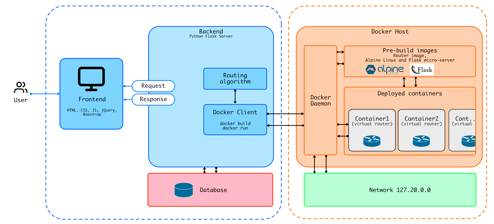

## Virtual Network Routing : MITS 5200

### Objective
The objective of this project is to develop a virtual routing network among virtual nodes. The nodes will be connected via network interfaces. The user should have the ability to send and receive packets that travel between each virtual node. As per instructions the network will utilize distance vector routing protocol for routing and forwarding the packets between each virtual node.



### Group Members:

| Members | |
|---------|--------|
| Mahesh Ranaweera | Syeda Raunaq Fatima |


### Content
```sh
.
├── containers # container test files
├── frontend   # multi-session frontend
├── install.sh # Installer for anaconda environment
├── server     # backend server and single-session frontend
│   ├── app
│   │   ├── containers
│   │   ├── server.py   # main server file
└── virtualnet.yml
```

### Setup
- Please makesure system requirements are met before running the application, refer: [Env Setup](#environment-setup-and-requirements)

#### Start the server
1. Start docker monitor on another terminal
```sh
watch docker ps
```
2. Initialize the environment
```sh
conda activate virtualenv
```
3. Start server will be available on [http://localhost:8080](http://localhost:8080)
```sh
cd server/app
python server.py
```
4. Following interface will appear;
   1. User can ADD Nodes (recomment maximum of 10 nodes)
   2. Under combination add cost values (at least one field has to be filled)
   3. Click Deploy to set the containers
   4. Proposed routing will be shown with the path of best calculated routing
      1. If successfully deployed containers will be shown on `docker ps`
      2. Each containers web interface can be accessed via its ip on subnet 172.20.0.0;
         1. NodeA http://172.20.0.20:8080/
         2. NodeB http://172.20.0.21:8080/
         3. NodeC http://172.20.0.22:8080/

### Environment Setup and requirements

1. Install docker and docker-compose:
    https://www.digitalocean.com/community/tutorials/how-to-install-and-use-docker-compose-on-ubuntu-20-04

2. Install miniconda for conda environment
    ```sh
    chmod +x install.sh
    ./install.sh
    ```
3. Install packages and create conda environmnet
    ```sh
    conda env create -f virtualnet.yml
    ```